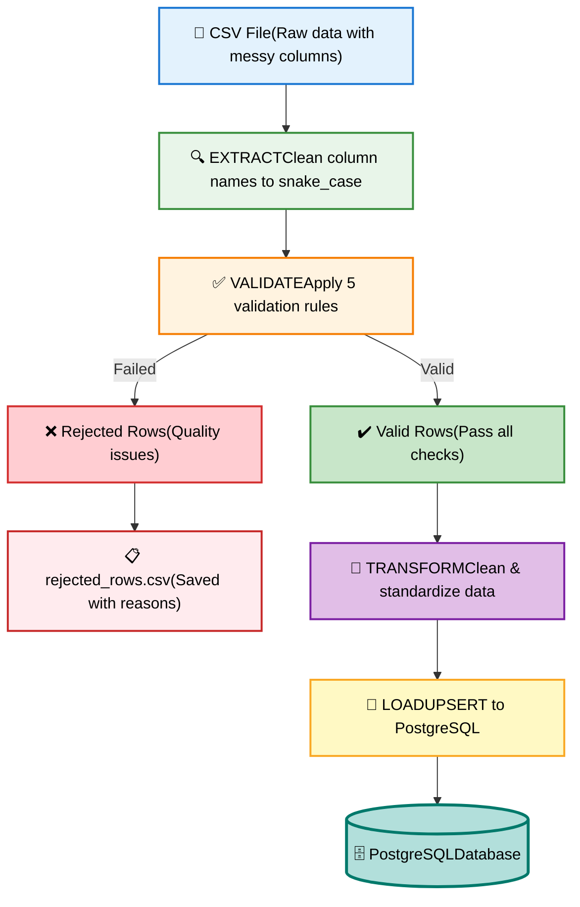
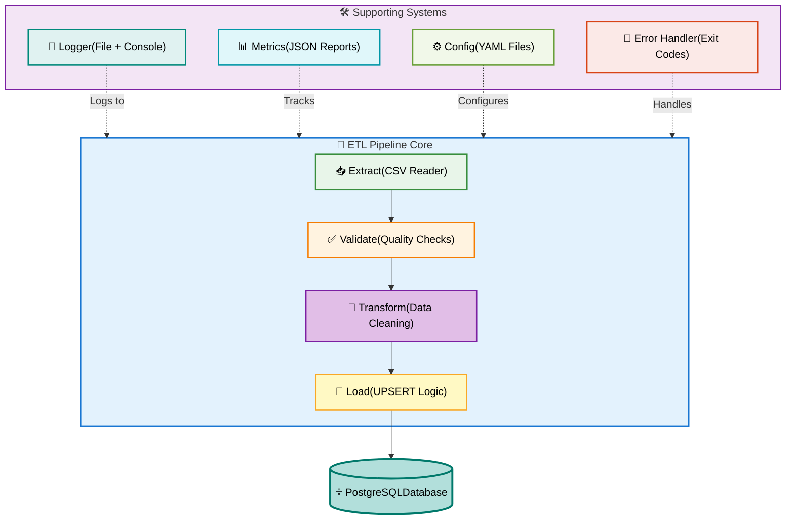

# CSV to Database ETL Pipeline

A production-ready Python ETL (Extract, Transform, Load) pipeline that processes CSV files and loads them into PostgreSQL with comprehensive data validation, quality checks, and monitoring.

## Overview

This ETL pipeline provides a robust, scalable solution for loading CSV data into PostgreSQL with built-in data quality checks, error handling and comprehensive logging.  Perfect for data engineering projects, analytics pipelines, and learning production-grade ETL patterns.

## Key Features

- **Extract**: Read csv files with automatic column name standardization
- **Validate**: 5-rule validation system with rejected row tracking
- **Transform**: Data cleaning and standardization (whitespace, casing, dates)
- **Load**: Idempotent UPSERT logic (safe to run mulptiple times)
- **Logging**: Structured logging to files with rotation
- **Metrics**: JSON reports with execution statistics
- **Error Handling**: Proper exit codes for scheduler integration
- **Config-Driven**: YAML-based configuration
- **Tested**: Comprehensive test suite with pytest (24+ tests)

## Table of Contents

- [Architecture](#architecture)
- [Prerequisites](#prerequisites)
- [Installation](#installation)
- [Quick Start](#quick-start)
- [Usage](#usage)
- [Configuration](#configuration)
- [Pipeline Stages](#pipeline-stages)
- [Data Validation](#data-validation)
- [Error Handling](#error-handling)
- [Metrics & Reporting](#metrics--reporting)
- [Testing](#testing)
- [Troubleshooting](#troubleshooting)
- [Project Structure](#project-structure)
- [License](#license)

## Arhitecture

### Pipeline Flow



### System Components



---

## Prerequisites

- **Python 3.10+** - [Download](https://www.python.org/downloads/)
- **Docker Desktop** - [Download](https://www.docker.com/products/docker-desktop/)
- **Git** - [Download](https://git-scm.com/downloads)

## Installation

### 1. Clone the Repository

```bash
git clone https://github.com/yourusername/csv-to-db-etl.git
cd csv-to-db-etl
```

### 2. Create Virtual Environment

```bash
# Windows
python -m venv .venv
.venv\Scripts\Activate.ps1

# Linux/Mac
python3 -m venv .venv
source .venv/bin/activate
```

### 3. Install Dependencies

```bash
pip install -r requirements.txt
```

**Dependencies:**
- `psycopg[binary]>=3.1.0` - PostgreSQL adapter
- `pandas>=2.0.0` - Data manipulation
- `python-dotenv>=1.0.0` - Environment variables
- `pyyaml>=6.0.0` - Configuration files
- `pytest>=7.4.0` - Testing framework

### 4. Start PostgreSQL Database

```bash
docker compose up -d
```

This starts PostgreSQL 15 with:
- Port: 5432
- Database: etl_db
- User: etl_user
- Password: etl_password

### 5. Create Database Tables

```bash
python -m src.create_tables
```

Creates the schema defined in `sql/schema.sql`.

### 6. Verify Installation

```bash
# Run tests
pytest

# Run pipeline with sample data
python -m src.main --config configs/customers.yaml
```

## Quick Start

### Run the Pipeline

```bash
# Using config file (recommended)
python -m src.main --config configs/customers.yaml

# Using command-line arguments (legacy)
python -m src.main --input data/raw/customers.csv --table customers
```

### Expected Output

Starting ETL Pipeline
[1/4] Extracting data from CSV...
✓ Extracted 10,000 rows and 4 columns
[2/4] Validating data...
Validation Summary:
Total rows: 10,000
Valid rows: 9,850 (98.5%)
Rejected rows: 150 (1.5%)
[3/4] Transforming data...
✓ Applied transformations
[4/4] Loading data into database...
✓ Upserted 9,850 rows into 'customers' table
• Inserted: 1,234 new rows
• Updated: 8,616 existing rows

============================================================
Pipeline completed successfully!
Exit code: 0 - Success

### Check the Results

```bash
# View logs
cat logs/etl_*.log

# View metrics report
cat reports/customers_etl_*.json

# View rejected rows (if any)
cat data/processed/rejected_customers.csv

# Query database
docker exec -it csv_to_db_postgres psql -U etl_user -d etl_db
SELECT COUNT(*) FROM customers;
```

---

# Usage

### Configuration File Structure

Create a YAML config file for each table:

```yaml
# configs/customers.yaml

table: customers
input_path: data/raw/customers.csv
delimiter: ","

validation:
  required_columns:
    - customer_id
    - full_name
    - email
    - created_at
  
  non_null_columns:
    - customer_id
    - full_name
    - email
    - created_at
  
  integer_columns:
    - customer_id
  
  datetime_columns:
    - created_at

output:
  rejected_file: data/processed/rejected_customers.csv
  clean_file: data/processed/clean_customers.csv
```

### Running the Pipeline

```bash
# Run with config
python -m src.main --config configs/customers.yaml

# View help
python -m src.main --help

# Check exit code (PowerShell)
echo $LASTEXITCODE

# Check exit code (Linux/Mac)
echo $?
```
### Exit Codes

| Code | Meaning | Description |
|------|---------|-------------|
| 0 | Success | Pipeline completed successfully |
| 1 | General Error | Unhandled exception |
| 2 | Invalid Arguments | Wrong command-line arguments |
| 3 | File Not Found | Input file doesn't exist |
| 4 | File Read Error | Can't read input file |
| 5 | No Valid Rows | All data failed validation |
| 6 | Validation Error | Data quality issues |
| 7 | DB Connection Error | Can't connect to PostgreSQL |
| 8 | DB Load Error | Failed to load data |
| 9 | Config Error | Invalid or missing config |

---

## Configuration

### Environment Variables

Create a `.env` file (not committed to Git):

```bash
# Database connection
DB_HOST=localhost
DB_PORT=5432
DB_NAME=etl_db
DB_USER=etl_user
DB_PASSWORD=etl_password
```
### Adding New Tables

1. **Create schema** in `sql/schema.sql`:
```sql
   CREATE TABLE products (
       product_id INTEGER PRIMARY KEY,
       product_name TEXT NOT NULL,
       price NUMERIC(10,2) NOT NULL
   );
```

2. **Create config** `configs/products.yaml`:
```yaml
   table: products
   input_path: data/raw/products.csv
   validation:
     required_columns: [product_id, product_name, price]
     non_null_columns: [product_id, product_name, price]
     integer_columns: [product_id]
```

3. **Run pipeline**:
```bash
   python -m src.main --config configs/products.yaml
```

---

## Pipeline Stages

### 1. Extract

**What it does:**
- Reads CSV file
- Cleans column names to snake_case
- Handles special characters and spaces

**Example:**

"Full Name" → "full_name"
"Email@Address" → "email_address"
"Customer#ID" → "customer_id"

### 2. Validate

**5 Validation Rules:**

1. **Required Columns** - All specified columns must exist
2. **Null Checks** - Critical fields cannot be empty
3. **Type Validation** - Fields must match expected types (integer, datetime)
4. **Format Validation** - Dates must be parseable
5. **Uniqueness** - Primary keys cannot have duplicates

**Failed rows are saved to:** `data/processed/rejected_<table>.csv` with rejection reasons.

### 3. Transform

**Data Cleaning:**
- **Title case** for names: "JOHN DOE" → "John Doe"
- **Lowercase** for emails: "JOHN@EMAIL.COM" → "john@email.com"
- **Trim whitespace**: "  data  " → "data"
- **Date normalization**: Various formats → ISO 8601

### 4. Load

**UPSERT Logic** (PostgreSQL `ON CONFLICT DO UPDATE`):
- If row exists (matched by primary key) → UPDATE
- If row doesn't exist → INSERT
- **Idempotent**: Safe to run multiple times!

**Example:**
```sql
INSERT INTO customers (customer_id, full_name, email, created_at)
VALUES (1, 'John Doe', 'john@email.com', '2024-01-15')
ON CONFLICT (customer_id)
DO UPDATE SET
  full_name = EXCLUDED.full_name,
  email = EXCLUDED.email,
  created_at = EXCLUDED.created_at;
```

---

## Data Validation

### Validation Process

```python
# Example validation config
validation:
  required_columns: [customer_id, full_name, email]
  non_null_columns: [customer_id, email]
  integer_columns: [customer_id]
  datetime_columns: [created_at]
```

### Rejection Tracking

**Rejected rows CSV includes:**
- All original columns
- 'rejection_reason' column explaining why rejected

**Example rejected row:**
```csv
customer_id,full_name,email,created_at,rejection_reason
ABC,John Doe,john@email.com,2024-01-15,invalid customer_id (not an integer)
```

### Validation Best Practices

- Start lenient, tighten over time
- Review rejected rows regularly
- Alert when rejection rate > threshold
- Track rejection trends over time

## Error Handling

### Error Recovery

The pipeline handles errors gracefully:

```python
try:
    df = extract_csv(input_file)
except FileNotFoundError:
    logger.error(f"File not found: {input_file}")
    return EXIT_FILE_NOT_FOUND  # Exit code 3
```

### Scheduler Integration

**Compatible with:**
- Apache Airflow
- Cron
- Windows Task Scheduler
- Jenkins
- GitHub Actions

**Example Airflow DAG:**

```python
from airflow import DAG
from airflow.operators.bash import BashOperator

dag = DAG('customer_etl', schedule_interval='0 2 * * *')

run_etl = BashOperator(
    task_id='load_customers',
    bash_command='python /etl/src/main.py --config /etl/configs/customers.yaml',
    dag=dag
)
```

Airflow will:
- Mark task as SUCCESS if exit code = 0
- Mark task as FAILED if exit code ≠ 0
- Send alerts on failure

---

## Metrics & Reporting

### Metrics Reports

After each run, a JSON report is generated:

```json
{
  "pipeline_name": "customers_etl",
  "execution_id": "20260417_223045_abc123",
  "start_time": "2026-04-17T22:30:45.123456",
  "end_time": "2026-04-17T22:30:52.789012",
  "duration_seconds": 7.67,
  "exit_code": 0,
  "status": "SUCCESS",
  "metrics": {
    "rows_extracted": 10000,
    "rows_validated": 9850,
    "rows_rejected": 150,
    "rows_transformed": 9850,
    "rows_loaded": 9850,
    "rejection_rate_percent": 1.5
  },
  "data_quality": {
    "validation_errors": {
      "null_values": 45,
      "invalid_integer": 32,
      "duplicate": 73
    }
  }
}
```

### Using Metrics

```python
# Load and analyze reports
import json
import pandas as pd
from pathlib import Path

reports = []
for file in Path('reports').glob('*.json'):
    with open(file) as f:
        reports.append(json.load(f))

df = pd.DataFrame(reports)
print(df[['start_time', 'duration_seconds', 'rejection_rate_percent']])
```

---

## Testing

### Run Tests

```bash
# Run all tests
pytest

# Run with verbose output
pytest -v

# Run specific test file
pytest tests/test_validate.py

```

### Test Coverage

**Current test suite: 24 tests**

- `test_validate.py` - 5 validation tests
- `test_transform.py` - 8 transformation tests
- `test_config_loader.py` - 5 config tests
- `test_error_handling.py` - 6 error scenario tests

### Writing New Tests

```python
# tests/test_your_feature.py
import pytest
from src.your_module import your_function

def test_your_feature():
    # Arrange
    input_data = ...
    
    # Act
    result = your_function(input_data)
    
    # Assert
    assert result == expected_output
```

---

## Troubleshooting

### Common Issues

#### 1. Database Connection Error

**Error:** `Can't connect to PostgreSQL`

**Solutions:**
```bash
# Check if Docker is running
docker ps

# Check if PostgreSQL container is up
docker compose ps

# Restart containers
docker compose restart

# Check logs
docker logs csv_to_db_postgres
```

#### 2. File Not Found
**Error:** `File not found: data/raw/customers.csv`

**Solutions:**
- Check file path in config
- Verify file exists: `ls data/raw/`
- Check file permissions
- Use absolute path if needed

#### 3. Validation Errors

**Error:** `All rows failed validation`

**Solutions:**
```bash
# Check rejected rows file
cat data/processed/rejected_customers.csv

# Review rejection reasons
# Common issues:
# - Column name mismatch
# - Wrong data types
# - Missing required columns
```

#### 4. Import Errors

**Error:** `ModuleNotFoundError: No module named 'src'`

**Solutions:**
```bash
# Activate virtual environment
.venv\Scripts\Activate.ps1  # Windows
source .venv/bin/activate    # Linux/Mac

# Reinstall dependencies
pip install -r requirements.txt

# Run from project root
cd /path/to/csv-to-db-etl
python -m src.main --config ...
```

#### 5. Permission Denied

**Error:** `Permission denied: 'logs/etl.log'`

**Solutions:**
```bash
# Create directories
mkdir logs reports data/processed

# Fix permissions (Linux/Mac)
chmod -R 755 logs reports data

# Run as administrator (Windows)
# Right-click → Run as Administrator
```

### Debug Mode

```bash
# Enable debug logging
# Add to config.py:
LOG_LEVEL = "DEBUG"

# View detailed logs
cat logs/etl_*.log

# Check specific module
python -m src.extract  # Test extraction only
python -m src.validate  # Test validation only
```

---

## Project Structure

### Key Directories

| Directory | Purpose |
|-----------|---------|
| `configs/` | YAML configuration files for each table |
| `data/raw/` | Input CSV files (source data) |
| `data/processed/` | Output files (rejected/cleaned) |
| `logs/` | Timestamped execution logs |
| `reports/` | JSON metrics reports |
| `src/` | Python source code modules |
| `tests/` | Pytest test suite |

### Key Files

| File | Purpose |
|------|---------|
| `main.py` | Pipeline orchestrator (runs ETL) |
| `extract.py` | CSV reading and column cleaning |
| `validate.py` | Data quality validation (5 rules) |
| `transform.py` | Data transformation and cleaning |
| `load.py` | Database loading with UPSERT |
| `metrics.py` | Performance tracking and reporting |
| `logger.py` | Structured logging setup |
| `config_loader.py` | YAML configuration parser |
| `exit_codes.py` | Exit code constants for schedulers |

## License

This project is licensed under the MIT License - see the [LICENSE](LICENSE) file for details.

## Contact & Support

- **Issues**: [GitHub Issues](https://github.com/cosmincaba/csv-to-db-etl/issues)
- **Discussions**: [GitHub Discussions](https://github.com/cosmincaba/csv-to-db-etl/discussions)
- **Email**: cosmincaba07@gmail.com

## Related Technologies

- [Pandas Documentation](https://pandas.pydata.org/docs/)
- [PostgreSQL Documentation](https://www.postgresql.org/docs/)
- [pytest Documentation](https://docs.pytest.org/)
- [Apache Airflow](https://airflow.apache.org/)

---

## Roadmap

**Completed:**
- Basic ETL pipeline
- Data validation
- UPSERT logic
- Config-driven design
- Error handling
- Metrics & reporting
- Test suite

## Aknowledgments

Built with:
- Python
- PostgreSQL
- Docker
- pandas
- pytest

<div align="center">

**Made with luv for the data engineering community**

[⬆ Back to Top](#csv-to-database-etl-pipeline)

</div>